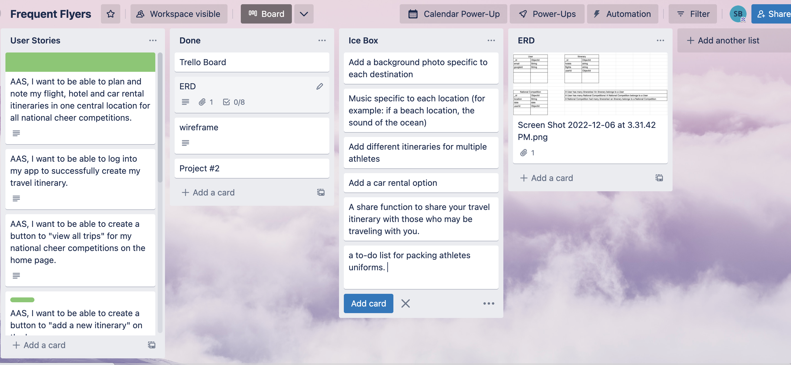

# Sophia Barber - Frequent Flyers

## Project Name: Frequent Flyers (A Cheer Mom's Itinerary Dream)
- - -
Game-Link: https://nice-tutu-pike.cyclic.app/

- - -
## Frequent Flyers Overview:
- - -
Frequent Flyers is an application developed by a cheer team mom. While traveling across the country during national cheer season, most cheer parents need one concise location to store all of their travel itinerary information to make travel easier. Frequent Flyers allows its' users to select the National Cheer Competition they are attending. Once the National Cheer Competition is selected, users may select the "view itinerary" link to add their outbound and inbound flights as well as their accomodations information. If you make a mistake and need to edit the National Cheer Competition users are able to do so. Users may also delete the National Cheer Competition and all of its' attached itinerary information once it has ended as well. 

## How To Use/Wireframe (Images Attached):
- - -
1. Landing Page:
   
   When a user reaches the applications landing page, homepage, they will have the option to log in. The user will not be able to use the application until they are signed in.

2. Let's Fly:
   
   After a user logs into the application, they will see a message titled "Let's Fly" along with their name associated with their google account due to oauth configurations. If the user chooses the "log out" option, it will send the user back to the landing page. 

3. All Nationals:
 
   Once the user chooses "All Nationals" it will send the user to the All Nationals page where they will be able to "Add a New National Competition". The user will be able to select the "view itinerary", "edit itinerary", "delete itinerary", "all national competitions" and "log out" options from this page. 

4. Add a New National Competition:
   
    Users will be able to a new National Competition from this page and include the National Competition name, location, date and time. 

5. Itinerary Page:
   
   Users will be able to view the National Competition they are attending above and input their outbound, inbound and accommodations on this page. Once the users flight and hotel accommodations are inputted, it will store at the bottom of this page for an easy reference. 

6. Edit Itinerary:
   
   Users will be able to edit their National Competition location on this page. 

7. Delete Itinerary:
 
   Users will be able to view all National Competitions on this page and select the "x" button next to each National Competition to delete it. 

## Trello:
- - -

https://trello.com/b/FXS97aoR/frequent-flyers

## ERD:
- - -

##  Technologies Used:
- - -
Javascript, HTML, CSS, MongoDB, EJS, Google oauth, 

##  Next Steps for the Future:
- - -
1. Add different itineraries for multiple athletes.
2. Add background music. 
3. Add a background photo that symbolizes the destination. 
4. Add other travel itinerary necessities such as a car rental option.
5. Add to-do list for packing athletes cheer uniforms, 
